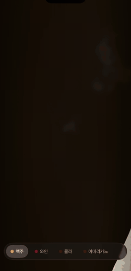
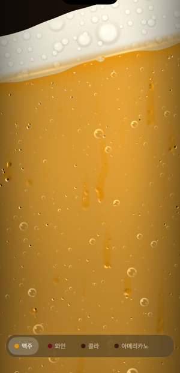
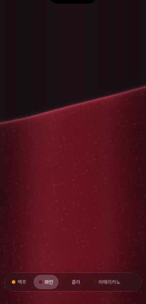
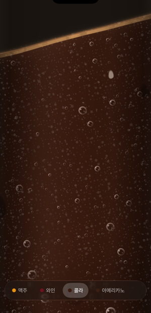
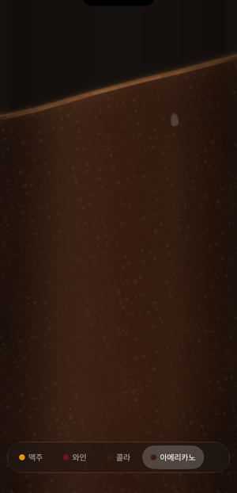

# sip

폰을 잔으로 쓰는 앱. 음료를 고르고, 기울여서 마신다.

2000년대 초 iBeer 를 React Native 로 다시 만든 것이다. 액체는 WebGPU 프래그먼트
셰이더로 그리고, 기울기는 가속도계에서 온다.

<p align="center">
  
</p>

## 조작

| | |
|---|---|
| **기울이기** | 액체가 세상과 수평을 지킨다. 충분히 기울이면 흘러나간다 |
| **탭** | 다시 채운다 |
| **좌우 드래그** | 기울이기의 두 번째 입력. 폰을 책상에 두고도 쓸 수 있다 |
| **아래 유리 바** | 음료 전환 |

## 음료

| 맥주 | 와인 | 콜라 | 아메리카노 |
|---|---|---|---|
|  |  |  |  |

음료마다 셰이더를 따로 두지 않는다. 액체가 달라 보이는 이유를 다섯 축으로 뽑아
값만 바꾼다 — 거품 두께, 탄산, 불투명도, 점도, 시작 수위 (`src/drinks/catalog.ts`).

점도는 그림뿐 아니라 물리에도 걸린다. 되직한 음료는 수면이 늦게 따라오고 늦게
잦아들며 천천히 비워진다.

## 어떻게 도는가

액체는 입자 시뮬레이션이 아니다. **수면을 기울기 `tan(angle)` 인 직선 하나로 긋고**
그 아래를 프래그먼트 셰이더로 칠한다. 물리는 JS 쪽에서 스프링 하나만 돌린다.

```
가속도계 (x, y)
   ↓  중력 벡터를 매끄럽게 (각도를 누적하지 않는다)
   ↓  덜 감쇠된 스프링 → 늦게 따라오고, 넘고, 울린다
u.live = (수면 각도, 수위, 출렁임, 붓는 세기)
   ↓
WGSL 프래그먼트 셰이더 (백그라운드 스레드)
```

각도를 누적하면 폰이 수평에 가까울 때 `atan2` 가 잡음으로 사방을 가리키고, 그
잡음을 적분해 각도가 흘러간다. 그래서 방향을 **벡터로** 들고 매 프레임 각도를
뽑는다 (`src/liquid/useDrinkPhysics.ts`).

## 스택

- **Expo SDK 57** / React Native 0.86 / expo-router
- **[react-native-webgpu](https://github.com/wcandillon/react-native-webgpu)** — WebGPU 바인딩
- **[react-native-effects](https://github.com/blazejkustra/react-native-effects)** — 백그라운드 스레드에서 도는 WGSL `ShaderView`
- **expo-sensors** (가속도계), **expo-glass-effect** (하단 바), **react-native-gesture-handler**

`vendor/react-native-effects-main.tgz` 를 쓰는 이유가 있다. npm 에 배포된 0.3.0 에는
`u.liveData` 유니폼이 없어서 맥주 셰이더가 컴파일되지 않는다. 레포 main 을 직접
빌드해 넣었다. 정식 배포되면 `npm i react-native-effects` 로 갈아타면 된다.

## 실행

```bash
npm install
npx expo run:ios
```

**시뮬레이터에는 가속도계가 없다.** 기울이기는 실기기에서만 동작하고, 시뮬에서는
좌우 드래그로 확인한다. 위 데모 GIF 도 시뮬레이터에서 드래그 입력으로 촬영한 것이다.

## 출처와 라이선스

맥주(`src/liquid/BeerGlass.tsx`)와 기포 함수는
[blazejkustra/react-native-effects](https://github.com/blazejkustra/react-native-effects)
의 iBeer 예제에서 가져왔다 (MIT, © 2026 Blazej Kustra). 맥주는 그 데모와 똑같이
보여야 해서 수식과 상수를 손대지 않았다.

원본 예제의 물방울은 [Heartfelt](https://www.shadertoy.com/view/ltffzl) 파생이라
CC BY-NC-SA 3.0(비영리·동일조건)이 걸려 있었다. 상업적 사용을 막지 않으려고
**응결은 걷어내고 새로 썼다** (`src/liquid/DrinkGlass.tsx` 의 `beadAt` /
`frostLayer` / `runnerLayer` / `condensation`). 미세 구슬이 맺히고, 몇이 커져
중력을 따라 흘러내리고, 지나간 자리는 닦였다가 다시 서리는 세 단계다.

나머지는 MIT.
